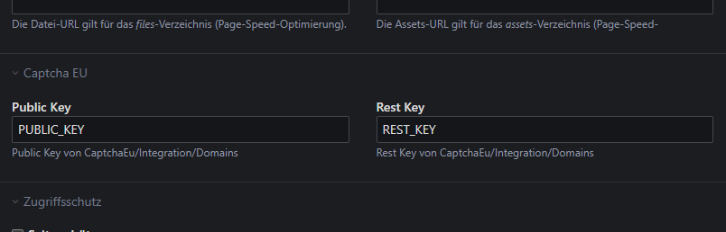
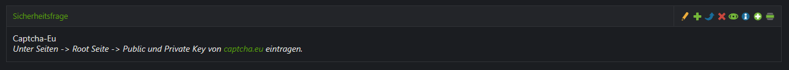

# captcha-eu

## Description
Mit unserem Captcha.eu-Plugin machst du deine Contao-Webseite ein gutes Stück sicherer. In nur wenigen Klicks bindest du den DSGVO-konformen Captcha-Dienst von Captcha.eu in deine Formulare ein und schützt dich zuverlässig vor Spam und Bots. Die Einrichtung erfolgt direkt im Contao Backend – einfach, schnell und ohne komplizierte Konfiguration.
Damit deine Seite nicht nur professionell aussieht, sondern auch bestens geschützt ist, brauchst du lediglich ein Konto bzw. einen passenden Plan bei Captcha.eu. Alle weiteren Informationen und Preisdetails findest du unter https://www.captcha.eu/


## Installation

Installation des Bundles via Composer:

```
composer require duncrow-gmbh/captcha-eu
```
Oder via Contao Manager: https://packagist.org/packages/duncrow-gmbh/captcha-eu

Das vorhandene Formularfeld Sicherheitsabfrage wird erweitert mit der Option "Verwende CaptchaEu". 
Den Lizenzkey kann unter Seiten - Startpunkt einer Website - Einstellungen - Captcha EU eingestellt werden.


## Images


