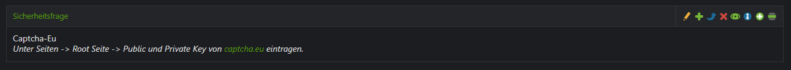
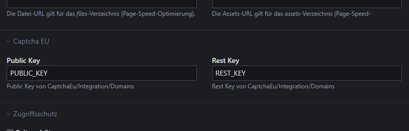
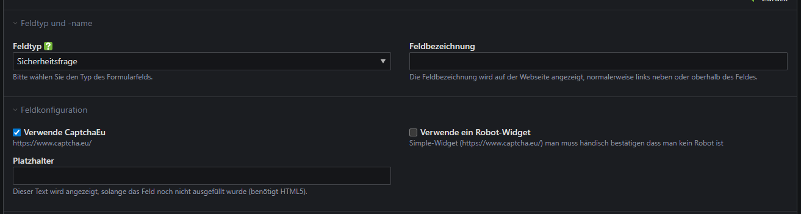
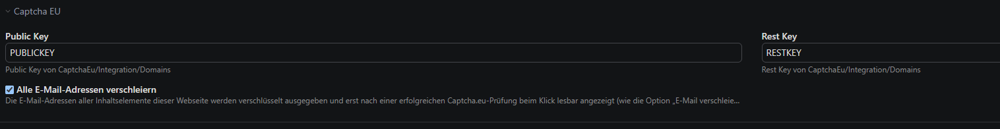
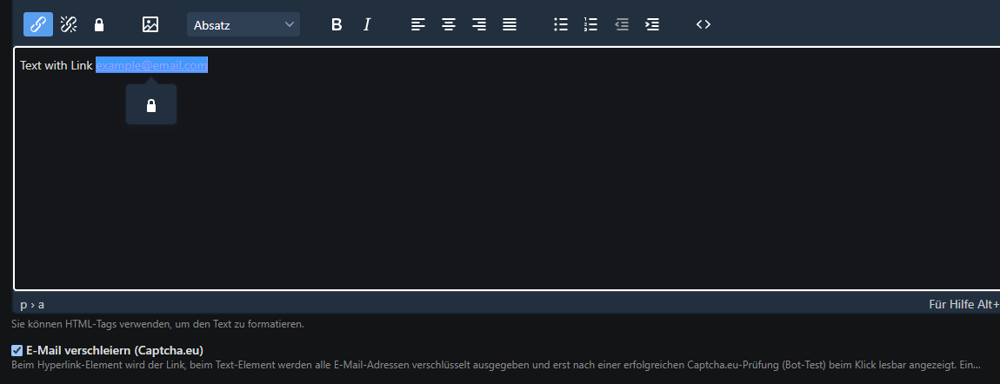

# captcha-eu

## Description
With our Captcha.eu plugin, you can make your Contao website a lot more secure. In just a few clicks, you can integrate Captcha.eu's GDPR-compliant captcha service into your forms and reliably protect yourself against spam and bots. Setup is done directly in the Contao backend – simple, fast and without complicated configuration.
To ensure that your site not only looks professional but is also well protected, all you need is an account or a suitable plan with Captcha.eu. You can find all further information and pricing details at https://www.captcha.eu/.

## Requirements

* Contao 5.7 or 6.x
* PHP 8.3 or newer

Development focuses on Contao 5.x. Contao 6.x is supported: the extension uses Twig templates and attribute-based configuration, works with both rich text editors (TinyMCE in Contao 5.7, HugeRTE in Contao 6) and has been tested with Contao 6.0, but less extensively than with 5.x. Please report any problems in the [issue tracker](https://github.com/duncrow-gmbh/captcha-eu/issues).

For Contao 4.13 and 5.3, use version 1.x of this extension.

## Installation

Installing the bundle via Composer:

```
composer require duncrow-gmbh/captcha-eu
```
Or via Contao Manager: https://packagist.org/packages/duncrow-gmbh/captcha-eu

The existing security query form field is expanded with the option ‘Use CaptchaEu’. The licence key can be set under Pages - Website start point - Settings - Captcha EU.

## Store license in the ‘Root’ page tree:




## Keys via environment variables
Instead of the root page settings, the keys can be set as environment variables (e.g. in `.env.local`). This way local, staging and production use their own keys, and they are not overwritten when the database is synced. Environment variables take precedence over the root page settings:

```
# All websites
CAPTCHA_EU_PUBLIC_KEY=...
CAPTCHA_EU_REST_KEY=...

# Only the website whose root page has the ID 17 (takes precedence over the variables above)
CAPTCHA_EU_PUBLIC_KEY_17=...
CAPTCHA_EU_REST_KEY_17=...
```

The suffix is the database ID of the root page (shown in the site structure), not its position in the list. If a key is overridden, the root page settings show a note with the name of the environment variable.

## Activate the plugin in your form.


Pages with a Captcha.eu form can be cached by the Contao HTTP cache: the page only contains the public key, the check runs in the browser. Forms that are added to the page later (e.g. loaded via AJAX or in a modal) are initialized automatically.

## Disguise e-mail addresses and links
Links can be protected against e-mail harvesters and bots. A protected link is replaced by an encrypted placeholder (e.g. `h…@…` for `hjanssen@captcha.eu`). When a visitor clicks on it, a Captcha.eu check runs in the background and the readable link appears in its place.

* **All content elements:** enable *Disguise all e-mail addresses* in the website root page (next to the Captcha.eu keys). This works like the per-element option on every content element of the website: all e-mail addresses in content elements are disguised (`mailto:` links and plain text). Layout and modules stay unchanged. Within elements, form fields, select options and scripts are never changed.
* **Hyperlink element:** enable *Disguise e-mail (Captcha.eu)* in the link settings.
* **Text element:** enable *Disguise e-mail (Captcha.eu)* below the text. All e-mail addresses in the text are disguised, both `mailto:` links and addresses written as plain text. Other links stay unchanged.
* **Text editor (TinyMCE):** place the cursor inside a link and click the lock button *Disguise e-mail (Captcha.eu)* (in the toolbar next to the link buttons, or in the small toolbar that appears at the link). Protected links are outlined with a dashed border in the editor.
* **Templates / custom HTML:** add the CSS class `captcha-eu-disguise` to any `<a>` element.

Disguise all e-mail addresses of the website (root page settings):



Text element with the lock button in the editor toolbar (and at the selected link) and the option to disguise all e-mail addresses of the element:



The public and REST keys of the website root are required. Without them, links are output unchanged.

One Captcha.eu check reveals all disguised e-mail addresses of the page at once. The successful check is remembered for 30 days: the server returns a signed verification token, which is stored in the browser's `localStorage` (key `captchaEuVerification`, one token per website root, only after the visitor clicked on an address). No cookie is used. As long as the token is valid, the addresses are revealed automatically on every page, without a new check. The page itself is always delivered with disguised addresses, so the HTTP cache never stores readable addresses.

## Content Security Policy
If the Contao CSP is enabled in the website root, the extension adds everything the Captcha.eu SDK needs to the policy of each page with a Captcha.eu form or disguised e-mail addresses, and passes nonces to the scripts and to the SDK's inline styles. No manual configuration is necessary.

If you use a different CSP setup (e.g. your own headers or NelmioSecurityBundle), allow the following sources:

| Directive | Source |
|---|---|
| `script-src` | `https://www.captcha.eu` |
| `connect-src` | `https://www.captcha.eu https://b.captcha.eu` |
| `worker-src` | `blob:` |
| `img-src` | `data:` |
| `style-src` | a nonce for the SDK (`window.CaptchaEUSettings.cspNonce`) or `'unsafe-inline'` |

Links marked with the class `captcha-eu-disguise` in custom templates outside of content elements are disguised, but the CSP sources are only added automatically for content elements and forms.

## Templates

| Template | Purpose |
|---|---|
| `form_captcha_eu.html.twig` | Captcha.eu form field (extends `@Contao/form_row.html.twig`) |
| `be_tinyCaptchaEu.html.twig` | TinyMCE configuration with the *Disguise e-mail* button (extends `@Contao/be_tinyMCE.html.twig`) |

The TinyMCE button is added to every field that uses the default `tinyMCE` configuration. Your own `be_tinyMCE` customizations are kept, because `be_tinyCaptchaEu` extends `be_tinyMCE`. For custom TinyMCE configurations, add the plugin to their `custom` block:

```twig
external_plugins: { captchaeu: '{{ asset('tinymce-captcha-eu.js', 'duncrow_gmbh_captcha_eu')|e('js') }}' },
```

## Upgrading from 1.x

* Contao 5.7+ and PHP 8.3+ are required.
* The form field template was renamed from `form_recaptcha.html5` to `form_captcha_eu.html.twig` (Twig). Custom `form_recaptcha` templates are no longer used and must be migrated.
* The captcha container no longer uses the fixed ID `dc-captcha-eu-checker` (which was duplicated with several forms on a page). It now has the class `dc-captcha-eu-checker` and the ID `dc-captcha-eu-checker-<field id>`. Update custom CSS that uses `#dc-captcha-eu-checker`.
* The scripts are no longer inline. With the Contao CSP, the required sources and nonces are added automatically (see "Content Security Policy").
* Run `php vendor/bin/contao-console contao:migrate` after the update.

## Development

The files in `public/` are versioned via `public/manifest.json` (content hash as `?v=` parameter), so browsers load the new files after an update. After changing a file in `public/`, regenerate the manifest:

```
composer manifest
```
