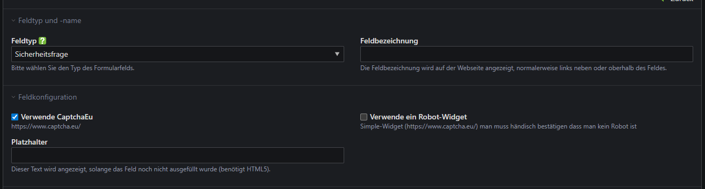

# captcha-eu

## Description
With our Captcha.eu plugin, you can make your Contao website a lot more secure. In just a few clicks, you can integrate Captcha.eu's GDPR-compliant captcha service into your forms and reliably protect yourself against spam and bots. Setup is done directly in the Contao backend – simple, fast and without complicated configuration.
To ensure that your site not only looks professional but is also well protected, all you need is an account or a suitable plan with Captcha.eu. You can find all further information and pricing details at https://www.captcha.eu/.

## Installation

Installing the bundle via Composer:

```
composer require duncrow-gmbh/captcha-eu
```
Or via Contao Manager: https://packagist.org/packages/duncrow-gmbh/captcha-eu

The existing security query form field is expanded with the option ‘Use CaptchaEu’. The licence key can be set under Pages - Website start point - Settings - Captcha EU.

## Store license in the ‘Root’ page tree:


## Activate the plugin in your form.

